

# Software Architecture Document

**Home Furniture Marketplace**

`SWE332 — Software Architecture` · `Altınbaş University` · `Spring 2026` · `Team thing.`

---

---

## Change History

| Version | Date | Author | Description |
|---------|------|--------|-------------|
| 1.0 | March 2026 | Team thing. | Initial document created |
| 2.0 | April 2026 | Team thing. | Refined and expanded non-architectural sections, including Scope, References, Goals & Constraints, Size & Performance, and Quality attributes.|
| 3.0 | April 2026 | Team thing. / Hasan Açıkel | Added Process View including thread model, concurrency design, authentication and purchase flow sequence diagrams, and end-to-end activity diagram. |
| 4.0 | April 2026 | Team thing. / Hasan Açıkel | Added Physical View including deployment diagram, Firebase infrastructure, network communication, and permissions. |
| 5.0 | April 2026 | Team thing. / Samed Tevin | Added Development View including layered architecture, package diagram, component diagram, and navigation flow. |
| 6.0 | April 2026 | Team thing. / Kağan Şahin | Added Use Case View including use case overview, end-to-end scenarios (registration to purchase, order tracking, app crash recovery), and corresponding Mermaid sequence and activity diagrams. |
| 7.0 | April 2026 | Team thing. / Doğukan Süme | Added Logical View aligned with the logical view, including core user journeys (registration, browsing, cart management, checkout, order tracking) and corresponding UML diagrams. |
| 8.0 | April 2026 | Team thing. | Document finalized. All architectural views reviewed and validated. Figures added and captioned across all sections. Documentation updated and overall layout redesigned for consistency. |

---

## Table of Contents

1. [Scope](#1-scope)
2. [References](#2-references)
3. [Software Architecture](#3-software-architecture)
4. [Architectural Goals & Constraints](#4-architectural-goals--constraints)
5. [Logical View](#5-logical-view)
6. [Process View](#6-process-view)
7. [Development View](#7-development-view)
8. [Physical View](#8-physical-view)
9. [Scenarios (Use Case View)](#9-scenarios-use-case-view)
10. [Size & Performance](#10-size--performance)
11. [Quality](#11-quality)

**Appendices**
- [A — Acronyms & Abbreviations](#appendix-a--acronyms--abbreviations)
- [B — Definitions](#appendix-b--definitions)
- [C — Design Principles](#appendix-c--design-principles)

---

## 1. Scope

**thing.** is a mobile-first Android application designed to provide a platform for browsing and purchasing high-quality home furniture products such as chairs, cupboards, tables, and accessories.

The system enables users to explore product listings, view detailed information, manage a shopping cart, and complete purchase operations.

The application emphasizes a simple, responsive, and user-friendly experience, supported by real-time data updates and modern Android design principles.

This document follows the 4+1 architectural view model proposed by Philippe Kruchten.

---

 
## 2. References
 
| ID | Title / Source | Link | Relevance |
|----|----------------|------|-----------|
| R1 | Android Developer Documentation — Activity & Fragment Lifecycle | [Android Activity Lifecycle Docs](https://developer.android.com/guide/components/activities/activity-lifecycle) | Navigation & lifecycle architecture |
| R2 | Firebase Documentation — Firestore | [Firebase Firestore Docs](https://firebase.google.com/docs/firestore) | Primary database service |
| R3 | Firebase Documentation — Authentication | [Firebase Authentication Docs](https://firebase.google.com/docs/auth) | Identity management |
| R4 | Firebase Documentation — Storage | [Firebase Storage Docs](https://firebase.google.com/docs/storage) | Image and media file storage |
| R5 | AndroidX Navigation Component Docs | [AndroidX Navigation Docs](https://developer.android.com/guide/navigation) | In-app navigation graph |
| R6 | Material Design 3 Guidelines | [Material Design 3 Guidelines](https://m3.material.io) | UI component library |
| R7 | Firebase Crashlytics SDK Docs | [Firebase Crashlytics Docs](https://firebase.google.com/docs/crashlytics) | Crash reporting integration |
| R8 | Glide Image Loading Library | [Glide on GitHub](https://github.com/bumptech/glide) | Image caching and loading |
| R9 | Kotlin Coroutines Guide | [Kotlin Coroutines Guide](https://kotlinlang.org/docs/coroutines-guide.html) | Async background operations |
| R10 | AndroidX Lifecycle — ViewModel & LiveData | [ViewModel & LiveData Docs](https://developer.android.com/topic/libraries/architecture/viewmodel) | MVVM state management |
| R11 | 4+1 Architectural View Model — Wikipedia | [4+1 Architectural View Model (Wikipedia)](https://en.wikipedia.org/wiki/4%2B1_architectural_view_model) | Architecture viewpoint framework overview |
| R12 | Architectural Blueprints — The "4+1" View Model of Software Architecture, Philippe Kruchten | [4+1 View Model — Philippe Kruchten (PDF)](https://www.cs.ubc.ca/~gregor/teaching/papers/4+1view-architecture.pdf) | Primary architecture viewpoint framework |
| R13 | SWE332 Course Slides — Altinbas University, Spring 2026 | — | Architecture viewpoint framework |
---

## 3. Software Architecture

thing. is a **native Android application** following the **Single-Activity, Multi-Fragment** architectural pattern. One Activity host manages all buyer-facing screens.

### 3.1 High-Level System Overview

The system is structured around the **4+1 Architectural View Model** (R11, R12):

| View | Concern | Primary Stakeholders |
|------|---------|----------------------|
| **Logical** | Functionality — classes, domain model, state | Analysts, designers |
| **Process** | Runtime behaviour — concurrency, sequences, activities | Integrators, performance engineers |
| **Development** | Software organisation — packages, components | Developers, project managers |
| **Physical** | Deployment topology — nodes, connectors | System engineers, DevOps |
| **Scenarios** | Use cases — end-to-end walkthroughs | All stakeholders |

*Figure 1 — 4+1 Architectural View Model overview and primary stakeholder mapping.*

---

<a href="assets/system_.png" target="_blank">
  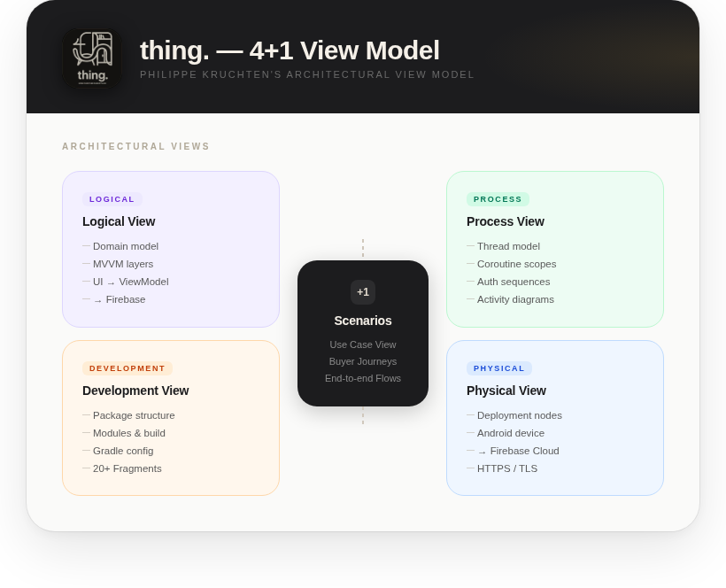
</a>

*Figure 2 — High-level system overview of the thing. application and its Firebase backend.*

---

### 3.2 Architectural Style

The system follows a **client-cloud** architecture. The Android client contains all UI and local business logic, while Firebase acts as the serverless backend for data persistence, identity management, and file storage. There is no custom application server — all backend communication happens through Firebase SDKs embedded in the client.

Within the Android client, the **AndroidX Navigation Component** manages a single Fragment back stack per Activity host, keeping screen transitions decoupled and the back stack predictable.

<a href="assets/arch_style.png" target="_blank">
  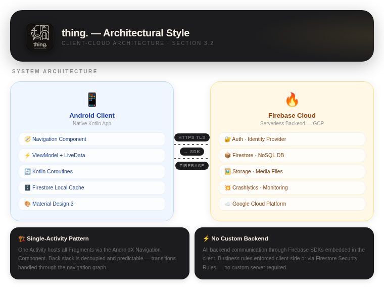
</a>

*Figure 3 — Client-cloud architectural style: Android client communicating with Firebase services over HTTPS/TLS.*

---

## 4. Architectural Goals & Constraints

### 4.1 Goals

| Goal | Description |
|------|-------------|
| **Scalability** | Firebase Firestore scales horizontally — no server provisioning needed as user counts grow. |
| **Usability** | Material Design 3 delivers a familiar, accessible experience across Android versions (API 24+). |
| **Real-Time Updates** | Firestore live listeners push product and order changes to the UI without polling. |
| **Reliability** | Firebase Crashlytics captures uncaught exceptions in production from day one. |
| **Offline Tolerance** | Firestore's local cache allows read access during intermittent connectivity. |
| **Extensibility** | Architecture is designed to accommodate new merchant and admin features in future releases without restructuring the core. |

### 4.2 Constraints

| Constraint | Impact |
|------------|--------|
| **Android-only (API 24–35 — Android 7.0–15)** | No iOS or web client in v1.0; limits initial reach. |
| **Firebase lock-in** | All persistence, auth, and storage are Firebase-dependent; migration would be costly. |
| **No custom backend** | Business rules enforced client-side or via Firestore Security Rules. |
| **Google Play Services required** | Google Sign-In requires Play Services on device. |
| **Academic scope** | Package `com.example.*` marks this as a prototype build, not a production-signed release. |

<a href="assets/goals_constraints.png" target="_blank">
  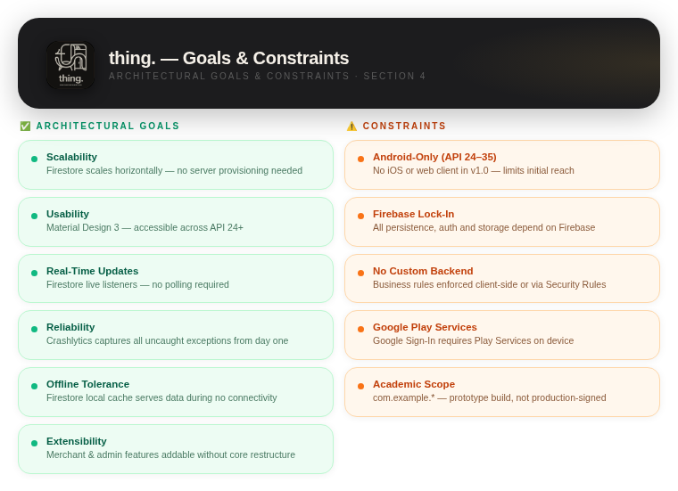
</a>

*Figure 4 — Summary of key architectural goals and constraints for the thing. system.*

---

## 5. Logical View

The logical view describes the functionality of the system from an end-user perspective, using class diagrams and state diagrams to show the structure of key domain objects.

### 5.1 Design Rationale — Object-Oriented Model

The logical view follows an **object-oriented design** using the core OOP principles of **abstraction**, **encapsulation**, and **inheritance** as its foundation.

**Abstraction** is applied by modelling only the attributes and operations each domain entity needs to fulfil its role in the system. `Product` exposes `isAvailable()` rather than leaking stock-count logic to callers; `Order` exposes `calculateTotal()` and `updateStatus()` instead of letting UI code manipulate fields directly.

**Encapsulation** is enforced through the MVVM pattern: domain model classes (`User`, `Product`, `Order`, `CartItem`, `Cart`) hold their own state and behaviour, ViewModels mediate all mutations, and Fragments observe results through `LiveData` without directly touching the model fields. This ensures that, for example, cart state cannot be corrupted by concurrent Fragment interactions because all write operations are funnelled through `CartViewModel`.

**Inheritance and composition** are used selectively. `CartItem` is composed inside `Cart` (aggregation) and references a `Product` (association), rather than inheriting from it — because a cart item is not a product, it is a line-item that holds a product reference alongside quantity and selection metadata. The `Category` enumeration is modelled as a closed type so that category-based filtering logic in the UI and Firestore queries remains exhaustive and type-safe.

This model was chosen — rather than an anemic domain model or a flat data-transfer structure — because it keeps business rules co-located with the data they protect, which simplifies testing and reduces the risk of invalid state propagating into Firestore.

### 5.2 Domain Class Diagram

The class diagram below represents the main domain entities, their attributes, and relationships in the thing. system.

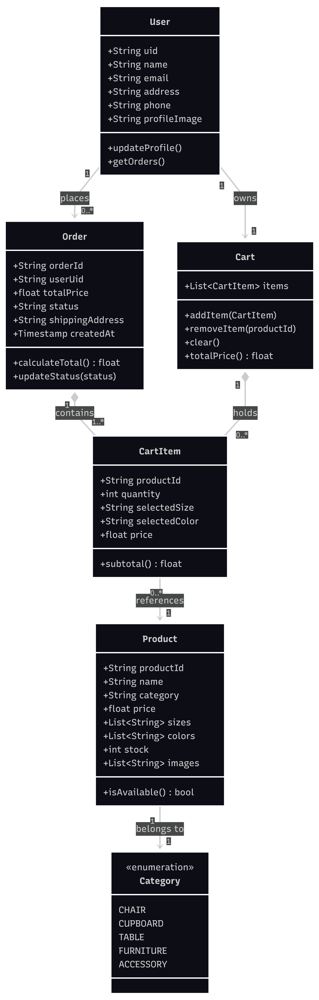

*Figure 5 — Domain class diagram showing core entities and their relationships.*

---

### 5.3 Order State Diagram

The state diagram captures all valid states of an Order entity and the transitions between them.

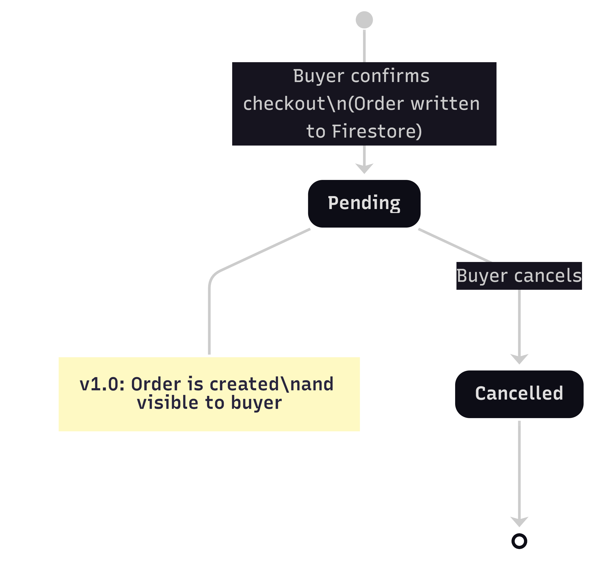

*Figure 6 — Order state diagram showing valid states and transitions.*

---

### 5.4 Product Categories

| Category | Description |
|----------|-------------|
| **Chair** | Seating — dining chairs, armchairs, sofas |
| **Cupboard** | Storage units, wardrobes, sideboards |
| **Table** | Dining, coffee, and work tables |
| **Furniture** | General / mixed furniture listings |
| **Accessory** | Decorative and functional home accessories |

---

## 6. Process View

The process view deals with the dynamic aspects of the system — runtime concurrency, communication, and control flow.

### 6.1 Thread Model & Concurrency

thing. runs multiple concurrent execution contexts, each with a clearly defined responsibility. Understanding which work happens on which thread — and why — is essential to evaluating the system's responsiveness and correctness.

| Thread / Context | Responsibility | Parallelism Role |
|------------------|----------------|------------------|
| **Main (UI) Thread** | Fragment rendering, user input, Navigation Component transitions | Single-threaded; all UI mutations must occur here |
| **Firebase SDK Thread Pool** | Firestore network I/O, Auth token refresh, Storage transfers | Runs in parallel with the UI thread; results are posted back via callbacks or Tasks |
| **WorkManager / JobScheduler** | DataTransport batch jobs — Crashlytics upload, analytics | Background; scheduled by OS; runs concurrently with user sessions |
| **Kotlin Coroutines (ViewModel scope)** | Async wrappers over Firebase Tasks inside ViewModel lifecycles | Structured concurrency; coroutines are cancelled when ViewModel is cleared |

**Why Kotlin Coroutines?**

Firebase's Java SDK exposes asynchronous results via `Task<T>` callbacks. Coroutines allow ViewModels to `await()` these Tasks using `suspendCancellableCoroutine`, transforming callback-style code into linear, readable suspend functions — without blocking the Main thread. Coroutines launched in `viewModelScope` are automatically cancelled when the Fragment that owns the ViewModel is destroyed, preventing memory leaks and stale UI updates.

**Parallel operations in the purchase flow:**

During checkout, the following operations may run concurrently:
- Firestore's real-time snapshot listener (background thread) continuing to push catalogue updates while the user edits their address.
- The `placeOrder` coroutine writing the order document to Firestore (Firebase thread pool), while the Main thread renders the BillingFragment confirmation UI.
- Crashlytics DataTransport flushing any buffered telemetry via JobScheduler, independent of both.

This separation ensures that a slow network write to Firestore does not freeze the UI, and that background telemetry work never competes with foreground user interactions on the Main thread.

---

### 6.2 Authentication Sequence Diagram

*Figure 7 — Authentication sequence diagram showing both new and returning user flows.*

---

### 6.3 Buyer Purchase Flow Sequence Diagram

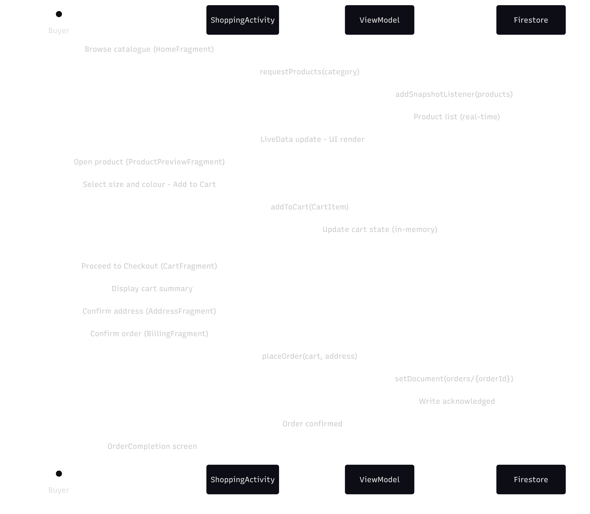

*Figure 8 — Purchase flow sequence diagram from product browsing to order confirmation.*

---

### 6.4 Activity Diagram — End-to-End Buyer Journey

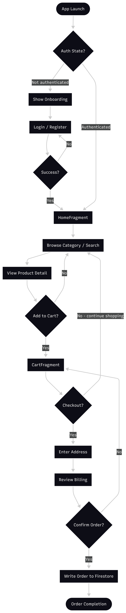

*Figure 9 — End-to-end activity diagram covering the full buyer journey from app launch to order completion.*

---

## 7. Development View

The development view illustrates the system from a programmer's perspective — how the software is organised into packages and components.

<a href="assets/dev_view.png" target="_blank">
  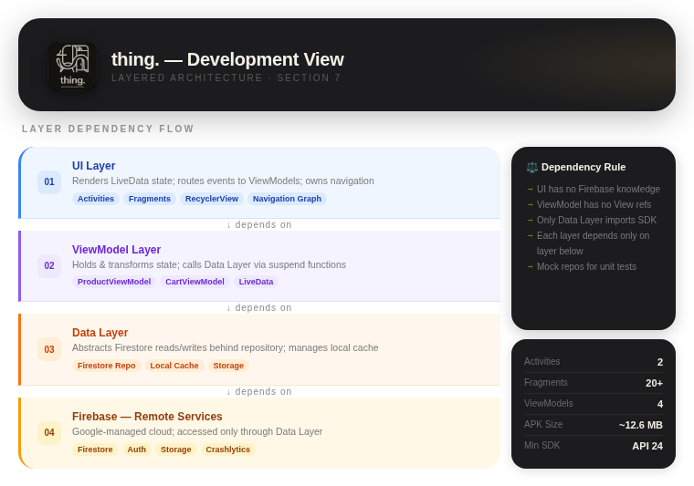
</a>

*Figure 10 — Development view overview showing the overall software organisation of the thing. application.*

## 7.1 Layered Architecture

The system follows a strict **layered architecture**, where each layer depends only on the layer directly below it and never on layers above. This enforces a clean separation of concerns, makes individual layers independently testable, and allows Firebase to be substituted in future versions without touching the UI or ViewModel layers.

<a href="assets/android_architecture_layered.png" target="_blank">
  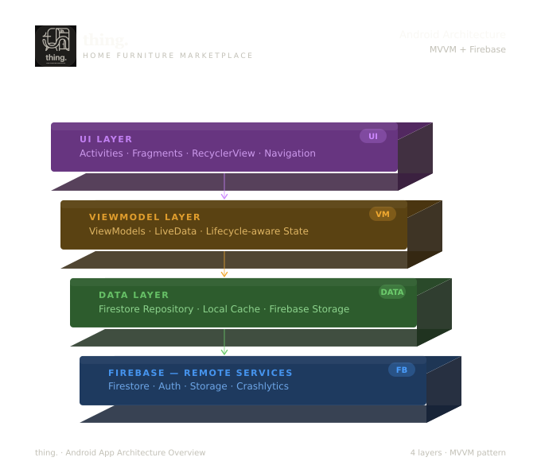
</a>

*Figure 11 — Android layered architecture: UI → ViewModel → Data → Firebase.*

---

### Layer responsibilities

| Layer | Role | Boundary rule |
|---|---|---|
| **UI Layer** | Renders state emitted by LiveData; routes user events to ViewModels; owns navigation transitions | No knowledge of Firestore or Firebase internals |
| **ViewModel Layer** | Holds and transforms application state; calls the Data Layer via suspend functions; survives configuration changes | No knowledge of Fragment or View references |
| **Data Layer** | Abstracts all Firestore reads and writes behind a repository interface; manages local cache synchronisation | Only layer that imports Firebase SDK types directly |
| **Firebase — Remote Services** | Google-managed cloud infrastructure; accessed exclusively through the Data Layer | Firestore · Auth · Storage · Crashlytics |

This four-tier layering was chosen over a flat structure because it enforces the Dependency Inversion Principle: the UI and ViewModel layers depend on abstractions (LiveData, repository interfaces), not on concrete Firebase SDK calls. This is what allows the ViewModel layer to be unit-tested with mock repositories without spinning up an emulator.

---

### 7.2 Package Diagram

<a href="assets/diagrams/package_diagram.png" target="_blank">
  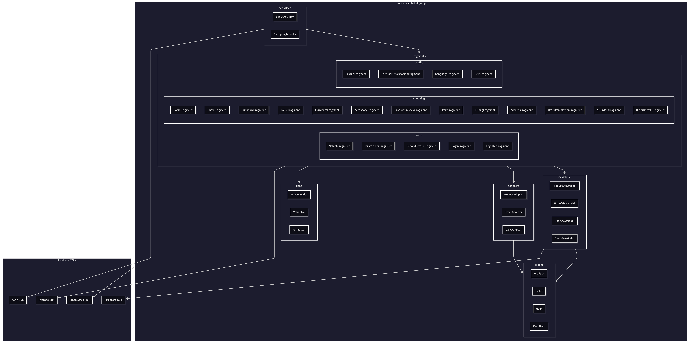
</a>

*Click on the image to enlarge.*

*Figure 12 — Package diagram showing the internal structure of the `com.example.thingapp` package and its dependencies on Firebase SDKs.*

---

### 7.3 Component Diagram

<a href="assets/diagrams/component_diagram.png" target="_blank">
  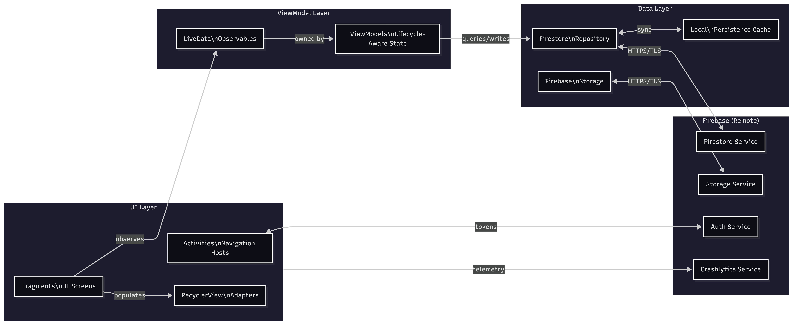
</a>

*Click on the image to enlarge.*

*Figure 13 — Component diagram illustrating the interactions between UI, ViewModel, Data, and Firebase layers.*

---

### 7.4 Navigation Flow

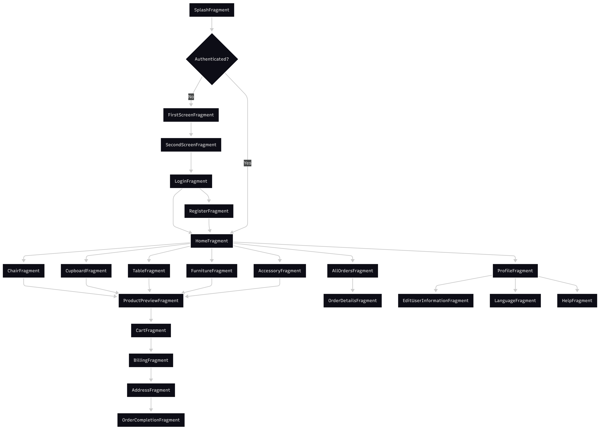

*Figure 14 — Navigation flow diagram showing all Fragment-to-Fragment transitions managed by the AndroidX Navigation Component.*

---

### 7.5 Key Libraries & Dependencies

| Library | Purpose |
|---------|---------|
| **Firebase Firestore** | Primary NoSQL document database for all app data |
| **Firebase Auth + FirebaseUI** | Email, Google, and phone authentication flows |
| **Firebase Storage** | Cloud storage for product images and user profile pictures |
| **Firebase Crashlytics** | Production crash monitoring and reporting |
| **Google Sign-In SDK** | OAuth-based Google login |
| **AndroidX Navigation** | Fragment back stack management via navigation graph |
| **Material Components (MDC 3)** | UI component library throughout |
| **RecyclerView** | Efficient product grid and order list rendering |
| **ViewBinding** | Type-safe view references in Fragments |
| **Lifecycle — ViewModel / LiveData** | Lifecycle-aware data observation |
| **Glide** | Image loading and caching into ImageViews |
| **Kotlin Coroutines** | Background async operations |

<a href="assets/tech_stack.png" target="_blank">
  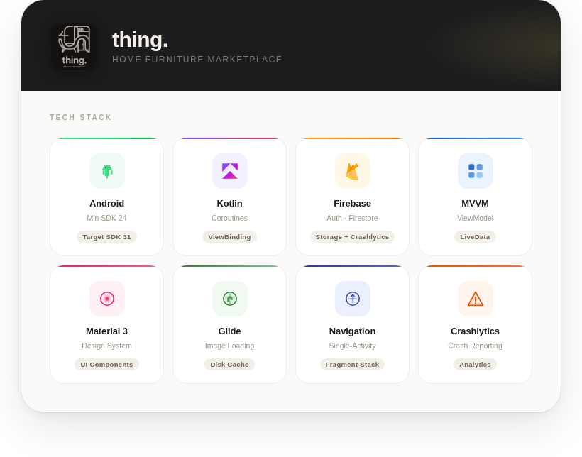
</a>

*Figure 15 — Technology stack overview showing all key libraries and SDKs used in the thing. application.*

### 7.6 Build Configuration

| Property | Value |
|----------|-------|
| Package | `com.example.thingapp` |
| Version | 1.0 |
| Min SDK | API 24 |
| Target SDK | API 35 (Android 15) |
| Compile SDK | API 35 |
| Build System | Gradle — Kotlin DSL (`build.gradle.kts`) |
| APK size | ~12.6 MB |
| Signing | Debug (academic build) |

---

## 8. Physical View

The physical view depicts the deployment topology — how software artefacts are distributed across physical or virtual nodes.

### 8.1 Deployment Diagram

<a href="assets/diagrams/deployment_diagram.png" target="_blank">
  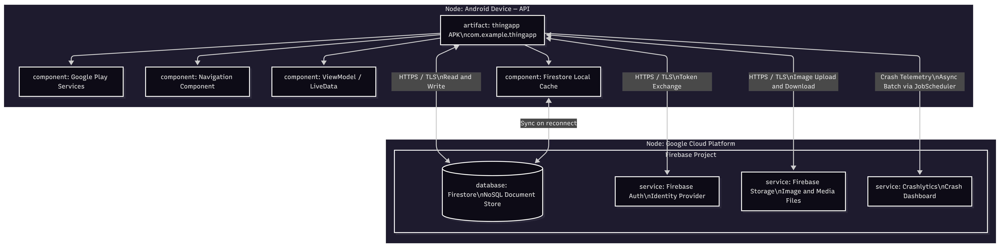
</a>

*Click on the image to enlarge.*

*Figure 16 — Deployment diagram showing the Android device node and Google Cloud Platform / Firebase node with all communication channels.*

---

### 8.2 Network & Permissions

| Permission | Purpose |
|------------|---------|
| `INTERNET` | All Firebase communication |
| `ACCESS_NETWORK_STATE` | Detect connectivity; fall back to Firestore local cache |

All client-to-Firebase traffic is encrypted via **HTTPS / TLS**. Firestore's **local persistence cache** serves reads during network loss. Firebase DataTransport batches Crashlytics payloads via `JobScheduler` to preserve battery life.

---

## 9. Scenarios (Use Case View)

The use case view illustrates the architecture through a small set of end-to-end scenarios. These validate the architectural decisions made in the Logical, Process, Development, and Physical views.

### 9.1 Use Case Overview

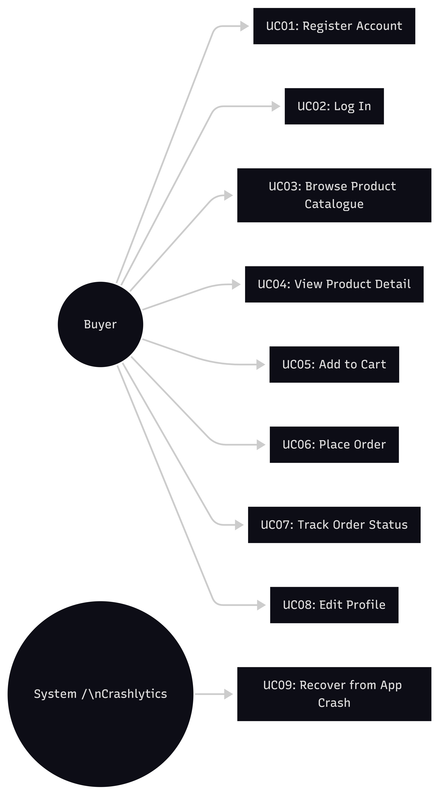

*Figure 17 — Use case overview diagram showing all supported use cases and their actors.*

---

### SC01 — New Buyer: Registration to First Purchase

| Field | Detail |
|-------|--------|
| **Scenario ID** | SC01 |
| **Title** | New Buyer: Registration to First Purchase |
| **Actors** | Buyer, Firebase Auth (FirebaseUI), Firestore |
| **Preconditions** | App installed; user has no existing account |
| **Postconditions** | Order document written to Firestore; buyer sees OrderCompletion screen |
| **Architectural Views Exercised** | Logical (User, Order, Cart domain), Process (auth sequence, purchase sequence), Physical (Auth service, Firestore) |

**Use Case Diagram:**

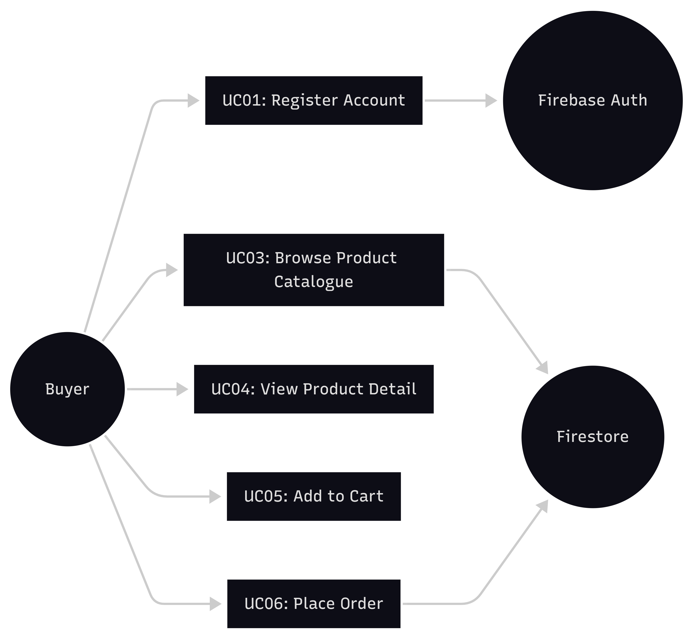

*Figure 18 — SC01 use case diagram: new buyer registration to first purchase.*

---

**Use Case Steps:**

| Step | ID | Actor | Action | System Response |
|------|----|-------|--------|-----------------|
| 1 | UC01 | Buyer | Opens app for the first time | SplashFragment checks auth state — unauthenticated |
| 2 | — | System | Detects no session | Launches onboarding: FirstScreenFragment to SecondScreenFragment |
| 3 | UC01 | Buyer | Taps Get Started | LoginFragment displayed |
| 4 | UC01 | Buyer | Registers via email or Google | FirebaseUI authenticates — JWT issued — user document created in Firestore |
| 5 | — | System | Auth confirmed | Navigates to HomeFragment |
| 6 | UC03 | Buyer | Browses product catalogue | HomeFragment attaches Firestore real-time listener; product grid rendered |
| 7 | UC04 | Buyer | Taps a product tile | ProductPreviewFragment shown with images, sizes, and colours |
| 8 | UC05 | Buyer | Selects size and colour, taps Add to Cart | CartItem appended to in-memory cart state in CartViewModel |
| 9 | UC06 | Buyer | Proceeds to checkout | CartFragment to AddressFragment to BillingFragment |
| 10 | UC06 | Buyer | Confirms order | Order document written to Firestore; OrderCompletionFragment displayed |

**Sequence Diagram:**

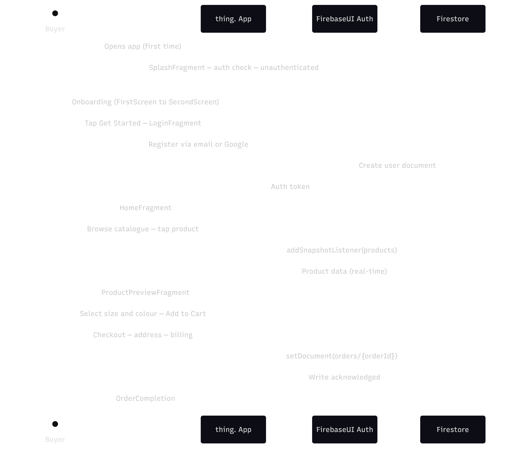

*Figure 19 — SC01 sequence diagram: full flow from registration to order confirmation.*

---

### SC02 — Returning Buyer: Track an Existing Order

| Field | Detail |
|-------|--------|
| **Scenario ID** | SC02 |
| **Title** | Returning Buyer: Track an Existing Order |
| **Actors** | Buyer, Firestore |
| **Preconditions** | Buyer is authenticated; at least one order exists in Firestore |
| **Postconditions** | Buyer sees live order status; UI updates automatically if status changes |
| **Architectural Views Exercised** | Logical (Order state diagram), Process (real-time listener), Physical (Firestore, local cache) |

**Use Case Diagram:**

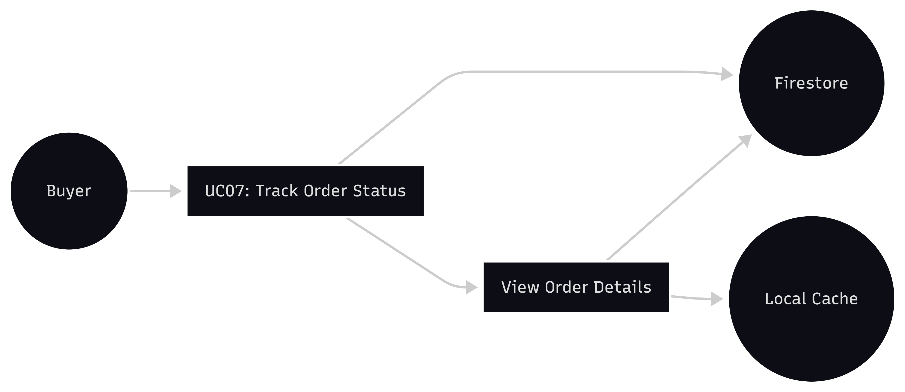

*Figure 20 — SC02 use case diagram: returning buyer tracking an existing order.*

---

**Use Case Steps:**

| Step | ID | Actor | Action | System Response |
|------|----|-------|--------|-----------------|
| 1 | UC07 | Buyer | Opens the Orders tab | AllOrdersFragment attaches Firestore real-time listener on orders collection |
| 2 | — | System | Listener fires | Order list rendered with status badges |
| 3 | UC07 | Buyer | Taps an order row | OrderDetailsFragment shown: items, quantities, total, shipping address, status |
| 4 | — | System | Buyer loses network | Firestore local cache serves last-known data; offline indicator may appear |
| 5 | — | System | Network restored | Listener re-syncs; any status change reflected immediately |

**Sequence Diagram:**

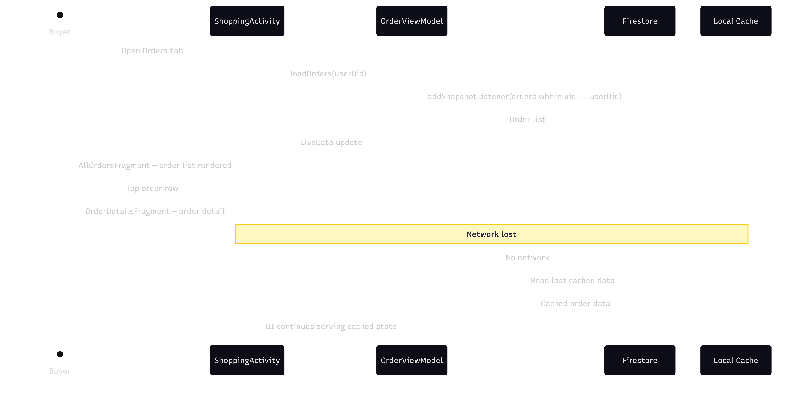

*Figure 21 — SC02 sequence diagram: order tracking with offline fallback to Firestore local cache.*

---

### SC03 — App Crash Recovery

| Field | Detail |
|-------|--------|
| **Scenario ID** | SC03 |
| **Title** | App Crash Recovery via Crashlytics |
| **Actors** | User, Crashlytics, Developer |
| **Preconditions** | App running in production; Crashlytics SDK initialised at startup |
| **Postconditions** | Full crash report visible in Crashlytics dashboard; developer can triage and fix |
| **Architectural Views Exercised** | Process (crash capture flow), Physical (Crashlytics node, DataTransport via JobScheduler) |

**Use Case Diagram:**

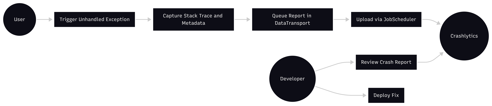

*Figure 22 — SC03 use case diagram: crash capture and recovery flow involving Crashlytics.*

---

**Use Case Steps:**

| Step | ID | Actor | Action | System Response |
|------|----|-------|--------|-----------------|
| 1 | UC09 | User | Triggers an unhandled exception | Crashlytics SDK captures stack trace, device metadata, and session context |
| 2 | — | System | Exception propagates | Android terminates the process; user sees system crash dialog |
| 3 | — | System | App restarts | Crashlytics SDK queues crash report in DataTransport buffer |
| 4 | — | System | Next network window available | JobScheduler fires DataTransport job; batch upload sent over HTTPS/TLS |
| 5 | UC09 | Developer | Opens Crashlytics dashboard | Full crash report visible: stack trace, OS version, device model, affected user count |
| 6 | UC09 | Developer | Prioritises and fixes defect | Hot fix deployed; Crashlytics monitors recurrence rate |

**Activity Diagram:**

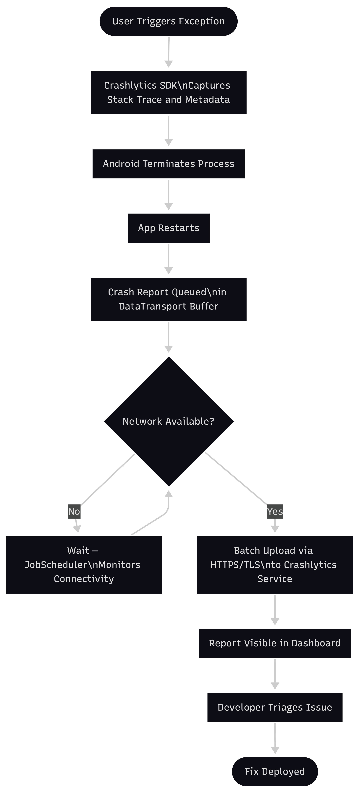

*Figure 23 — SC03 activity diagram: end-to-end crash capture, upload, and developer triage flow.*

---

## 10. Size & Performance

### 10.1 APK Metrics

| Metric | Value |
|--------|-------|
| Raw APK size | Unknown |
| Min SDK coverage | API 24+ (~99% of active Android devices) |
| Permissions required | 2 |

### 10.2 Performance Strategies

| Concern | Strategy |
|---------|----------|
| **Cold start** | LaunchActivity is a lightweight router — minimal initialisation before first screen render |
| **List rendering** | RecyclerView with view recycling across all product grids and order lists |
| **Image loading** | Glide handles disk and memory caching of product images from Firebase Storage |
| **Database reads** | Firestore listeners removed in onStop to avoid unnecessary reads when app is backgrounded |
| **Offline reads** | Firestore local persistence cache serves data during network interruption |
| **Background work** | Firebase DataTransport uses JobScheduler to batch uploads and preserve battery |

---

## 11. Quality

| Quality Attribute | Strategy | Evidence |
|-------------------|----------|----------|
| **Security** | Firebase Auth JWT tokens; Firestore Security Rules enforce per-uid data access | FirebaseUI Auth integration |
| **Reliability** | Crashlytics captures all uncaught exceptions; Firebase infrastructure SLA | crashlytics-build.properties |
| **Maintainability** | Single-Activity + Navigation Component; Fragment modularity eases feature addition | 1 Activity, 20+ Fragments |
| **Testability** | ViewModel separation from Fragments enables unit testing without instrumentation | androidx.lifecycle present |
| **Accessibility** | Material Design 3 built-in: content descriptions, contrast ratios, touch targets | com.google.android.material |
| **Portability** | Min SDK 24 covers ~99% of active Android devices | minSdkVersion="24" |
| **Observability** | Crashlytics + Firebase Analytics for runtime crash and usage insight | DataTransport services |
| **Extensibility** | Architecture is structured to accommodate merchant and admin features in future releases without core restructuring | Layered MVVM + Firebase design |

---

## Appendix A — Acronyms & Abbreviations

| Term | Definition |
|------|------------|
| **APK** | Android Package Kit — distribution format for Android applications |
| **API** | Application Programming Interface |
| **ART** | Android Runtime — executes DEX bytecode on-device |
| **DEX** | Dalvik Executable — bytecode format used by ART |
| **JWT** | JSON Web Token — compact token used for authentication |
| **MDC** | Material Design Components — Google's UI component library |
| **MVVM** | Model-View-ViewModel — UI architectural pattern |
| **NoSQL** | Non-relational database; Firestore is document-based |
| **SDK** | Software Development Kit |
| **TLS** | Transport Layer Security — protocol for encrypted network communication |
| **UID** | User Identifier — unique string assigned by Firebase Auth per registered user |
| **UC** | Use Case — a discrete unit of functionality |
| **SC** | Scenario — a concrete instantiation of one or more use cases |

---

## Appendix B — Definitions

| Term | Definition |
|------|------------|
| **Activity** | An Android component acting as a navigation host |
| **Fragment** | A modular UI screen hosted inside an Activity; every screen in thing. is a Fragment |
| **Firestore** | Google Firebase's managed document-oriented cloud database — the primary data backend for thing. |
| **Firebase Storage** | Google Firebase's cloud file storage — used for product images and profile pictures |
| **Navigation Component** | AndroidX library managing Fragment transactions and the back stack via a navigation graph |
| **Buyer** | An end consumer who browses and purchases furniture through the thing. marketplace |
| **Cart** | A transient collection of CartItem objects held in memory prior to checkout confirmation |
| **Order** | A confirmed purchase record persisted to Firestore after checkout |
| **ViewBinding** | AndroidX feature generating type-safe binding classes per layout, eliminating findViewById |
| **LiveData** | Lifecycle-aware observable from AndroidX Lifecycle; updates UI safely from ViewModel |
| **4+1 View Model** | Philippe Kruchten's architectural framework: Logical, Process, Development, Physical + Scenarios |

---

## Appendix C — Design Principles

| Principle | Application in thing. |
|-----------|----------------------|
| **Separation of Concerns** | Activities own navigation; Fragments own UI; ViewModels own data; Firestore owns persistence |
| **Single Activity Pattern** | One Activity hosts all Fragments, reducing lifecycle complexity |
| **Serverless First** | Firebase eliminates custom backend infrastructure — appropriate for this project scale |
| **Offline-First Reads** | Firestore local cache consulted before network; improves perceived responsiveness |
| **Fail-Safe Monitoring** | Crashlytics integrated from the first release, not added retrospectively |
| **Progressive Disclosure** | Onboarding screens introduce the marketplace before requesting registration |
| **Layered Architecture** | UI → ViewModel → Data → Firebase; each layer depends only on the layer below it, enabling independent testability and future substitution of Firebase services |
| **MVVM** | ViewModels hold and transform state; Fragments observe LiveData without directly touching model fields; ensures UI is driven by data, not imperative calls |
| **Single Responsibility Principle (SRP)** | Each class has one reason to change — Fragments handle rendering, ViewModels handle logic, repositories handle data access |
| **Don't Repeat Yourself (DRY)** | Shared UI components (e.g. product cards, order rows) are implemented once as reusable RecyclerView adapters and referenced across multiple screens |
| **Clean Code** | Descriptive naming, small focused functions, and no magic numbers — improves readability and reduces onboarding time for new contributors |

---

*Document maintained by Team thing. — SWE332, Altinbas University, Spring 2026.*

