# Software Architecture Document

**Home Furniture Marketplace**

`SWE332 — Software Architecture` · `Altınbaş University` · `Spring 2026` · `Team thing.`

---

---

## Change History

| Version | Date | Author | Description |
|---------|------|--------|-------------|
| 1.0 | March 2026 | Team thing. | Initial document created |
| 2.0 | April 2026 | Team thing. | Refined and expanded non-architectural sections, including Scope, References, Goals & Constraints, Size & Performance, and Quality attributes. |
| 3.0 | April 2026 | Team thing. / Hasan Açıkel | Added Process View including thread model, concurrency design, authentication and purchase flow sequence diagrams, and end-to-end activity diagram. |
| 4.0 | April 2026 | Team thing. / Hasan Açıkel | Added Physical View including deployment diagram, Firebase infrastructure, network communication, and permissions. |
| 5.0 | April 2026 | Team thing. / Samed Tevin | Added Development View including layered architecture, package diagram, component diagram, and navigation flow. |
| 6.0 | April 2026 | Team thing. / Kağan Şahin | Added Use Case View including use case overview, end-to-end scenarios, and corresponding Mermaid sequence and activity diagrams. |
| 7.0 | April 2026 | Team thing. / Doğukan Süme | Added Logical View aligned with the logical view, including core user journeys and corresponding UML diagrams. |
| 8.0 | April 2026 | Team thing. | Document finalized. All architectural views reviewed and validated. Figures added and captioned across all sections. |
| 9.0 | April 2026 | Team thing. / Samed Tevin | Appendix C expanded with MVVM, SRP, DRY and Clean Code design principles. System Overview diagram added to Section 3. |
| 10.0 | April 2026 | Team thing. / Samed Tevin | Updated documentation to reflect actual v1.0 app state and converted HTML tags to pure Markdown. |
| 11.0 | April 2026 | Team thing. / Samed Tevin | Reconciled document with actual source code and updated implemented/out-of-scope features. |

---

## Table of Contents

1. [Scope](#1-scope)
2. [References](#2-references)
3. [Software Architecture](#3-software-architecture)
4. [Architectural Goals & Constraints](#4-architectural-goals--constraints)
5. [Logical View](#5-logical-view)
6. [Process View](#6-process-view)
7. [Development View](#7-development-view)
8. [Physical View](#8-physical-view)
9. [Scenarios Use Case View](#9-scenarios-use-case-view)
10. [Size & Performance](#10-size--performance)
11. [Quality](#11-quality)

**Appendices**

- [A — Acronyms & Abbreviations](#appendix-a--acronyms--abbreviations)
- [B — Definitions](#appendix-b--definitions)
- [C — Design Principles](#appendix-c--design-principles)

---

## List of Figures

| No | Figure | Section |
|----|--------|---------|
| 1 | 4+1 Architectural View Model Overview | [3.1 — Overview of 4+1 architectural model](#31-high-level-system-overview) |
| 2 | High-Level System Overview | [3.1 — System context and overall structure](#31-high-level-system-overview) |
| 3 | Client-Cloud Architectural Style | [3.2 — Client-server interaction via Firebase](#32-architectural-style) |
| 4 | Architectural Goals & Constraints Summary | [4.2 — Key goals and system limitations](#42-constraints) |
| 5 | Domain Class Diagram | [5.2 — Core entities and relationships](#52-domain-class-diagram) |
| 6 | Order State Diagram | [5.3 — Order lifecycle and transitions](#53-order-state-diagram) |
| 7 | Authentication Sequence Diagram | [6.2 — User login and registration flow](#62-authentication-sequence-diagram) |
| 8 | Purchase Flow Sequence Diagram | [6.3 — End-to-end purchase interaction](#63-buyer-purchase-flow-sequence-diagram) |
| 9 | End-to-End Buyer Journey Activity Diagram | [6.4 — Full user journey workflow](#64-activity-diagram--end-to-end-buyer-journey) |
| 10 | Development View Overview | [7 — Software structure overview](#7-development-view) |
| 11 | Android Layered Architecture | [7.1 — UI, ViewModel, Data layers](#71-layered-architecture) |
| 12 | Package Diagram | [7.2 — Internal package organization](#72-package-diagram) |
| 13 | Component Diagram | [7.3 — System component interactions](#73-component-diagram) |
| 14 | Navigation Flow Diagram | [7.4 — Fragment navigation structure](#74-navigation-flow) |
| 15 | Technology Stack Overview | [7.5 — Libraries and technologies used](#75-key-libraries--dependencies) |
| 16 | Deployment Diagram | [8.1 — Physical deployment structure](#81-deployment-diagram) |
| 17 | Use Case Overview Diagram | [9.1 — All system use cases and actors](#91-use-case-overview) |
| 18 | SC01 — Use Case Diagram | [9.1 — New buyer registration scenario](#sc01--new-buyer-registration-to-first-purchase) |
| 19 | SC01 — Sequence Diagram | [9.1 — SC01 interaction flow](#sc01--new-buyer-registration-to-first-purchase) |
| 20 | SC02 — Use Case Diagram | [9.1 — Returning buyer tracking scenario](#sc02--returning-buyer-track-an-existing-order) |
| 21 | SC02 — Sequence Diagram | [9.1 — SC02 runtime flow](#sc02--returning-buyer-track-an-existing-order) |

---

## 1. Scope

**thing.** is a mobile-first Android application designed to provide a platform for browsing and purchasing high-quality home furniture products such as chairs, cupboards, tables, and accessories.

The system enables users to explore product listings, view detailed information, manage a shopping cart, and complete purchase operations. It also supports order tracking, address management, multi-language switching, a searchable FAQ Help screen, and user account management including profile photo upload.

The application emphasises a simple, responsive, and user-friendly experience, supported by real-time data updates and modern Android design principles.

This document follows the 4+1 architectural view model proposed by Philippe Kruchten.

### 1.1 Out of Scope

The following features are explicitly out of scope for the Version 1.0 prototype release:

- **Admin & Merchant Portals:** The application currently focuses entirely on the buyer's journey. Dashboard functionalities for sellers are deferred.
- **Cross-Platform:** iOS and Web applications are excluded; the initial system is strictly an Android client.
- **Advanced Crash Reporting:** Integrating external telemetry frameworks such as Firebase Crashlytics is out of scope for this version.
- **Third-Party Authentication Providers:** Identity focuses purely on Email/Password pairs managed directly via `FirebaseAuth`.
- **Dedicated Completion & Extended Onboarding:** Standalone splash modules or post-billing explicit UI screens are replaced with standard alerts and routing loops.
- **Network-State-Aware Offline Indicator:** Although Firestore's local cache serves reads during network interruption, there is no runtime `ACCESS_NETWORK_STATE` connectivity check or offline UI indicator in v1.0.
- **Unit & Instrumentation Tests:** No test sources are present in v1.0; the architecture is structured to support future testing through ViewModel and repository separation.

---

## 2. References

| ID | Title / Source | Link | Relevance |
|----|----------------|------|-----------|
| R1 | Android Developer Documentation — Activity & Fragment Lifecycle | [Android Activity Lifecycle Docs](https://developer.android.com/guide/components/activities/activity-lifecycle) | Navigation & lifecycle architecture |
| R2 | Firebase Documentation — Firestore | [Firebase Firestore Docs](https://firebase.google.com/docs/firestore) | Primary database service |
| R3 | Firebase Documentation — Authentication | [Firebase Authentication Docs](https://firebase.google.com/docs/auth) | Identity management |
| R4 | Firebase Documentation — Storage | [Firebase Storage Docs](https://firebase.google.com/docs/storage) | Image and media file storage |
| R5 | AndroidX Navigation Component Docs | [AndroidX Navigation Docs](https://developer.android.com/guide/navigation) | In-app navigation graph |
| R6 | Material Design 3 Guidelines | [Material Design 3 Guidelines](https://m3.material.io) | UI component library |
| R8 | Glide Image Loading Library | [Glide on GitHub](https://github.com/bumptech/glide) | Image caching and loading |
| R9 | Kotlin Coroutines Guide | [Kotlin Coroutines Guide](https://kotlinlang.org/docs/coroutines-guide.html) | Async background operations |
| R10 | AndroidX Lifecycle — ViewModel & LiveData | [ViewModel & LiveData Docs](https://developer.android.com/topic/libraries/architecture/viewmodel) | MVVM state management |
| R11 | 4+1 Architectural View Model — Wikipedia | [4+1 Architectural View Model](https://en.wikipedia.org/wiki/4%2B1_architectural_view_model) | Architecture viewpoint framework overview |
| R12 | Architectural Blueprints — The "4+1" View Model of Software Architecture, Philippe Kruchten | [4+1 View Model — Philippe Kruchten](https://www.cs.ubc.ca/~gregor/teaching/papers/4+1view-architecture.pdf) | Primary architecture viewpoint framework |
| R13 | SWE332 Course Slides — Altinbas University, Spring 2026 | — | Architecture viewpoint framework |
| R14 | Dagger Hilt for Android | [Hilt Docs](https://developer.android.com/training/dependency-injection/hilt-android) | Compile-time dependency injection |

---

## 3. Software Architecture

thing. is a **native Android application** built around three Activities and a large set of Fragments managed by two separate Navigation Graphs.

- `LoginRegisterActivity` hosts the onboarding flow through `login_register_graph`.
- `ShoppingActivity` hosts all buyer-facing screens through `shopping_graph`.
- `MainActivity` is a lightweight internal utility Activity used for seeding product data into Firestore during development and is not part of the buyer-facing flow.

Dependency injection throughout the app is handled by **Dagger Hilt**, which provides singleton-scoped Firebase instances and the shared `FirebaseCommon` helper to ViewModels.

### 3.1 High-Level System Overview

The system is structured around the **4+1 Architectural View Model**.

| View | Concern | Primary Stakeholders |
|------|---------|----------------------|
| **Logical** | Functionality — classes, domain model, state | Analysts, designers |
| **Process** | Runtime behaviour — concurrency, sequences, activities | Integrators, performance engineers |
| **Development** | Software organisation — packages, components | Developers, project managers |
| **Physical** | Deployment topology — nodes, connectors | System engineers, DevOps |
| **Scenarios** | Use cases — end-to-end walkthroughs | All stakeholders |

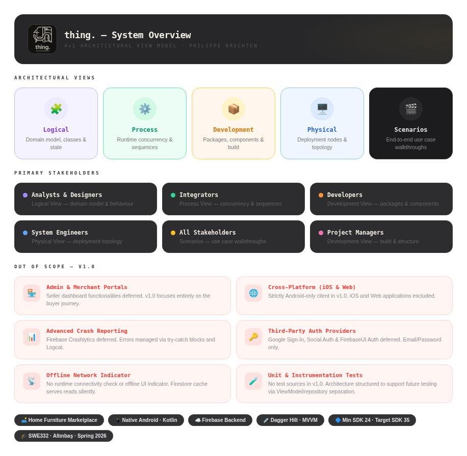

*Figure 1 — 4+1 Architectural View Model overview and primary stakeholder mapping.*

---

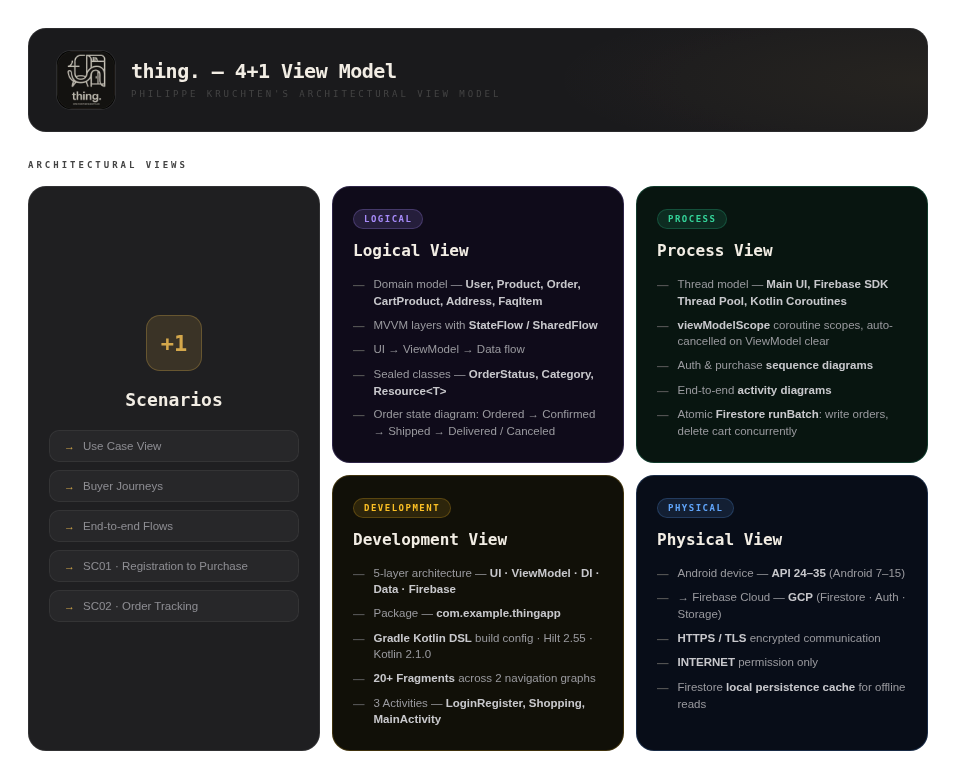

*Figure 2 — High-level system overview of the thing. application and its Firebase backend.*

---

### 3.2 Architectural Style

The system follows a **client-cloud** architecture. The Android client contains all UI and local business logic, while Firebase acts as the serverless backend for data persistence, identity management, and file storage. There is no custom application server.

Within the Android client, the **AndroidX Navigation Component** manages Fragment back stacks per Activity host. **Dagger Hilt** manages the object graph at compile time, eliminating manual dependency wiring across ViewModels and repositories.

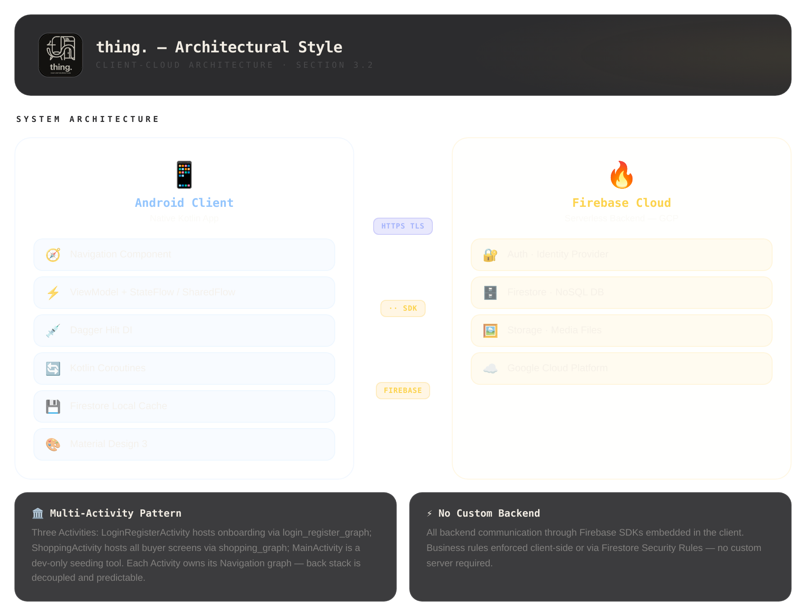

*Figure 3 — Client-cloud architectural style: Android client communicating with Firebase services over HTTPS/TLS.*

---

## 4. Architectural Goals & Constraints

### 4.1 Goals

| Goal | Description |
|------|-------------|
| **Scalability** | Firebase Firestore scales horizontally with no server provisioning needed as user counts grow. |
| **Usability** | Material Design 3 delivers a familiar, accessible experience across Android versions. |
| **Real-Time Updates** | Firestore live listeners push product and order changes to the UI without polling. |
| **Offline Tolerance** | Firestore's local cache allows read access during intermittent connectivity. |
| **Extensibility** | Architecture can accommodate merchant and admin features in future releases. |
| **Localisation** | English and Turkish string resource sets with runtime locale switching. |

### 4.2 Constraints

| Constraint | Impact |
|------------|--------|
| **Android-only** | No iOS or web client in v1.0. |
| **Firebase lock-in** | Persistence, auth, and storage depend on Firebase. |
| **No custom backend** | Business rules are enforced client-side or via Firestore Security Rules. |
| **Email/Password auth only** | `FirebaseAuth` with email/password is the sole authentication method. |
| **Academic scope** | Package `com.example.*` marks this as a prototype build. |

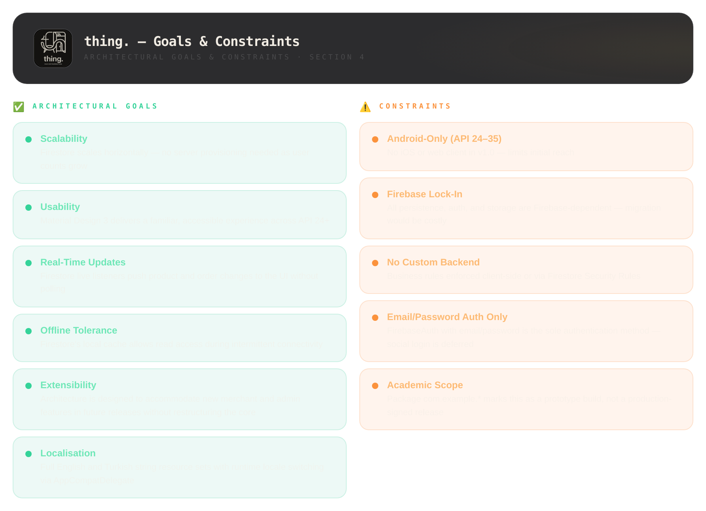

*Figure 4 — Summary of key architectural goals and constraints for the thing. system.*

---

## 5. Logical View

The logical view describes the functionality of the system from an end-user perspective, using class diagrams and state diagrams to show the structure of key domain objects.

### 5.1 Design Rationale — Object-Oriented Model

The logical view follows an **object-oriented design** using the core OOP principles of **abstraction**, **encapsulation**, and **inheritance** as its foundation.

**Abstraction** is applied by modelling only the attributes and operations each domain entity needs to fulfil its role in the system.

**Encapsulation** is enforced through the MVVM pattern: domain model classes hold their own state, ViewModels mediate mutations, and Fragments observe results through `StateFlow` and `SharedFlow`.

**Inheritance and composition** are used selectively. `CartProduct` is composed inside the cart state held by `CartViewModel` and references a `Product`, rather than inheriting from it. `Category` and `OrderStatus` are modelled as sealed classes to support exhaustive UI handling.

### 5.2 Domain Class Diagram

The class diagram below represents the main domain entities, their attributes, and relationships in the thing. system.

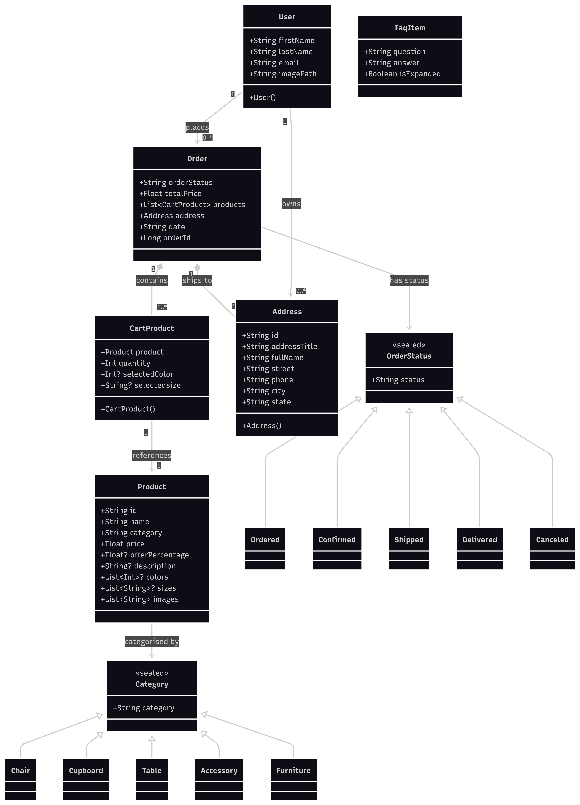

*Figure 5 — Domain class diagram showing core entities and their relationships.*

---

### 5.3 Order State Diagram

The state diagram captures all valid states of an Order entity and the transitions between them.

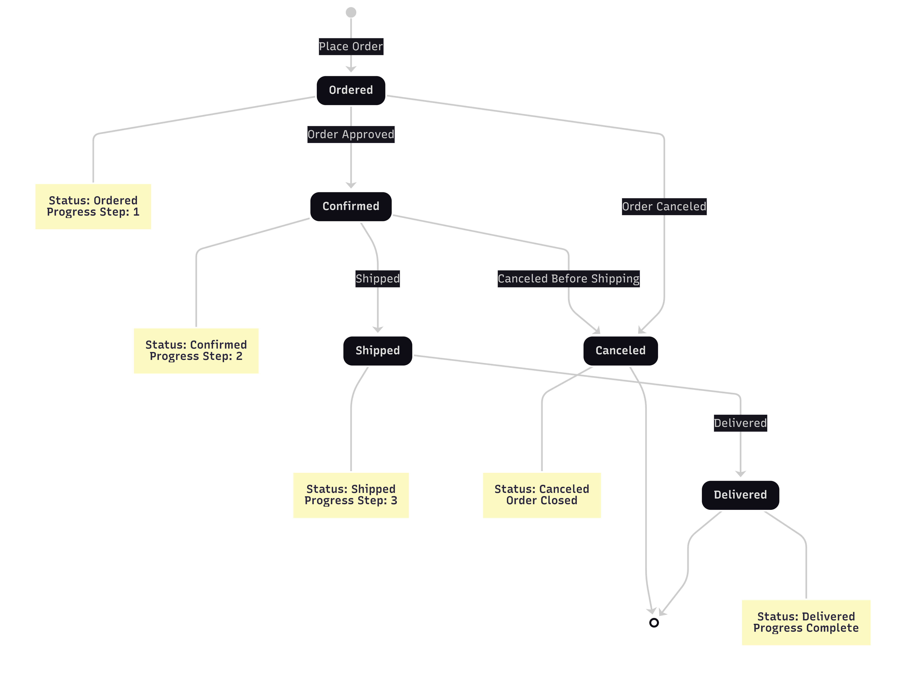

*Figure 6 — Order state diagram showing valid states and transitions.*

---

### 5.4 Product Categories

| Category | Description |
|----------|-------------|
| **Chair** | Seating — dining chairs, armchairs, sofas |
| **Cupboard** | Storage units, wardrobes, sideboards |
| **Table** | Dining, coffee, and work tables |
| **Furniture** | General and mixed furniture listings |
| **Accessory** | Decorative and functional home accessories |

---

## 6. Process View

The process view deals with the dynamic aspects of the system, including runtime concurrency, communication, and control flow.

### 6.1 Thread Model & Concurrency

| Thread / Context | Responsibility | Parallelism Role |
|------------------|----------------|------------------|
| **Main UI Thread** | Fragment rendering, user input, Navigation Component transitions | Single-threaded; all UI mutations must occur here |
| **Firebase SDK Thread Pool** | Firestore network I/O, Auth token refresh, Storage transfers | Runs in parallel with the UI thread |
| **Kotlin Coroutines** | Async wrappers over Firebase Tasks inside ViewModel lifecycles | Structured concurrency; cancelled when ViewModel is cleared |

Firebase's Java SDK exposes asynchronous results via `Task<T>` callbacks. Coroutines allow ViewModels to await these Tasks in a readable way without blocking the Main thread.

During checkout, Firestore snapshot listeners, order placement, and UI rendering may run concurrently. This separation prevents slow network writes from freezing the interface.

### 6.2 Authentication Sequence Diagram

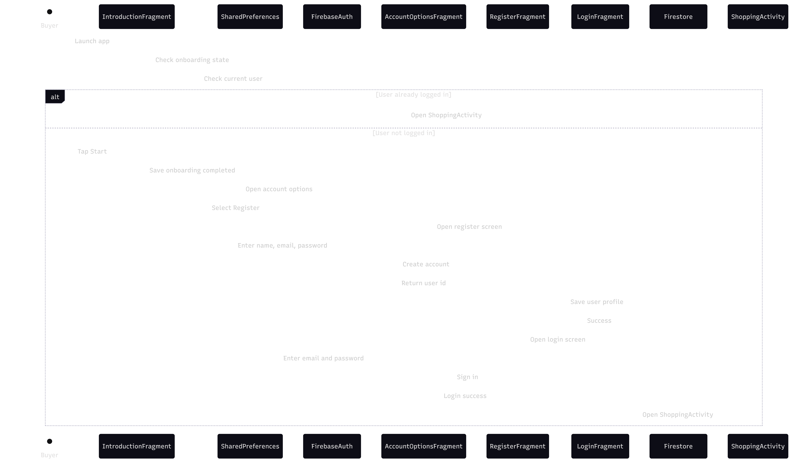

*Figure 7 — Authentication sequence diagram showing both new and returning user flows.*

---

### 6.3 Buyer Purchase Flow Sequence Diagram

*Figure 8 — Purchase flow sequence diagram from product browsing to order confirmation.*

---

### 6.4 Activity Diagram — End-to-End Buyer Journey

*Figure 9 — End-to-end activity diagram covering the full buyer journey from app launch to order completion.*

---

## 7. Development View

The development view illustrates the system from a programmer's perspective, showing how the software is organised into packages and components.

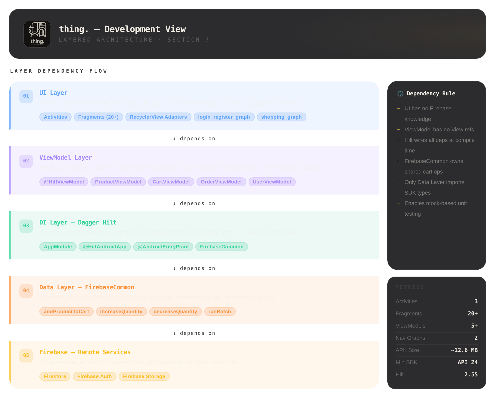

*Figure 10 — Development view overview showing the overall software organisation of the thing. application.*

---

## 7.1 Layered Architecture

The system follows a strict **layered architecture**, where each layer depends only on the layer directly below it and never on layers above.

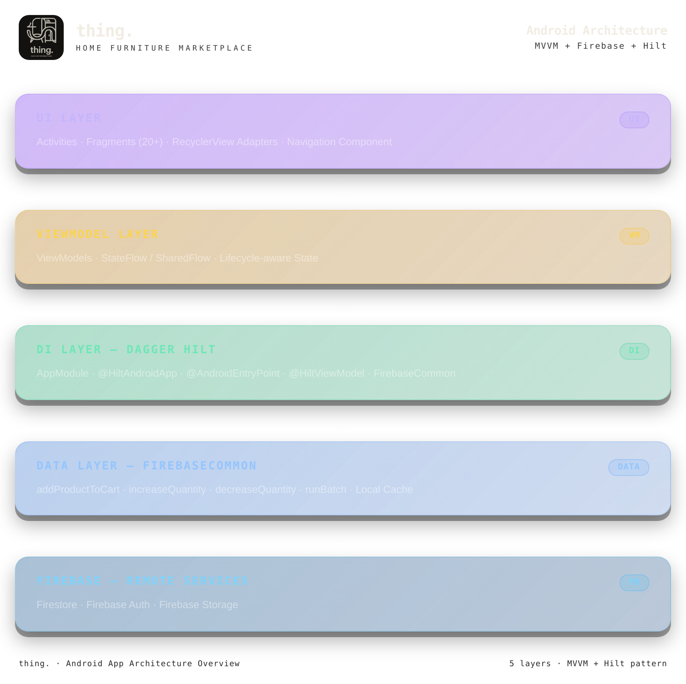

*Figure 11 — Android layered architecture: UI → ViewModel → Data → Firebase.*

---

### Layer Responsibilities

| Layer | Role | Boundary Rule |
|---|---|---|
| **UI Layer** | Renders state emitted by `StateFlow`/`SharedFlow`; routes user events to ViewModels | No knowledge of Firestore internals |
| **ViewModel Layer** | Holds and transforms application state; calls Firebase SDK directly or via `FirebaseCommon` | No knowledge of Fragment or View references |
| **DI Layer** | Provides singleton Firebase instances and shared helpers | Defined in `AppModule` |
| **Data Layer** | `FirebaseCommon` abstracts recurring Firestore cart operations | Imports Firebase SDK types for shared operations |
| **Firebase Services** | Google-managed cloud infrastructure | Firestore, Auth, Storage |

This layering enforces separation of concerns and allows the ViewModel layer to be tested with mock dependencies in future versions.

### 7.2 Package Diagram

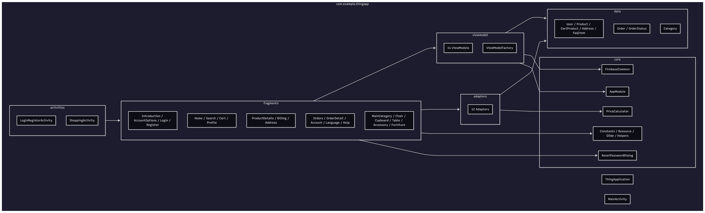

*Figure 12 — Package diagram showing the internal structure of the `com.example.thingapp` package and its dependencies on Firebase SDKs.*

---

### 7.3 Component Diagram

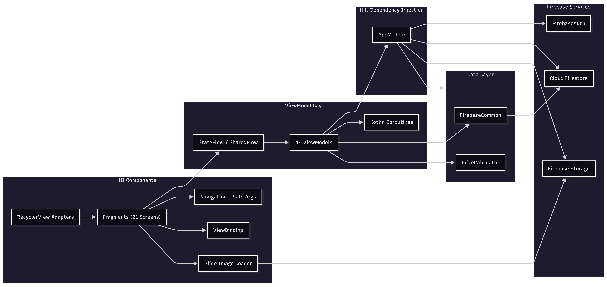

*Figure 13 — Component diagram illustrating the interactions between UI, ViewModel, Data, and Firebase layers.*

---

### 7.4 Navigation Flow

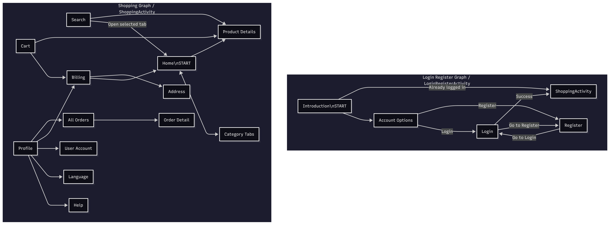

*Figure 14 — Navigation flow diagram showing all Fragment-to-Fragment transitions managed by the AndroidX Navigation Component.*

---

### 7.5 Key Libraries & Dependencies

| Library | Purpose |
|---------|---------|
| **Firebase Firestore** | Primary NoSQL document database |
| **Firebase Auth** | Email and password authentication |
| **Firebase Storage** | Cloud storage for product images and user profile pictures |
| **Dagger Hilt** | Compile-time dependency injection |
| **AndroidX Navigation** | Fragment back stack management |
| **Material Components** | UI component library |
| **RecyclerView** | Product grid and order list rendering |
| **ViewBinding** | Type-safe view references |
| **Lifecycle — ViewModel / StateFlow / SharedFlow** | Lifecycle-aware state observation |
| **Glide** | Image loading and caching |
| **Kotlin Coroutines** | Background async operations |
| **Intuit SDP / SSP** | Scalable size units |
| **CircleImageView** | Circular profile and colour swatch images |
| **StepView** | Order status progress indicator |
| **Loading Button Android** | Circular progress animation on action buttons |
| **ColorPickerView** | HSV colour picker used in development seeding |
| **SmoothBottomBar** | Declared but superseded by Material `BottomNavigationView` |

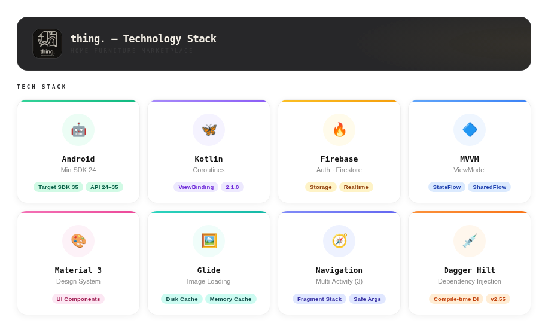

*Figure 15 — Technology stack overview showing all key libraries and SDKs used in the thing. application.*

---

### 7.6 Build Configuration

| Property | Value |
|----------|-------|
| Package | `com.example.thingapp` |
| Version | 1.0 |
| Min SDK | API 24 |
| Target SDK | API 35 |
| Compile SDK | API 35 |
| Build System | Gradle — Kotlin DSL |
| Java / Kotlin target | Java 17 / Kotlin 2.1.0 |
| APK size | ~12.6 MB |
| Signing | Debug academic build |
| DI framework | Dagger Hilt 2.55 |

---

## 8. Physical View

The physical view depicts the deployment topology and how software artefacts are distributed across physical or virtual nodes.

### 8.1 Deployment Diagram

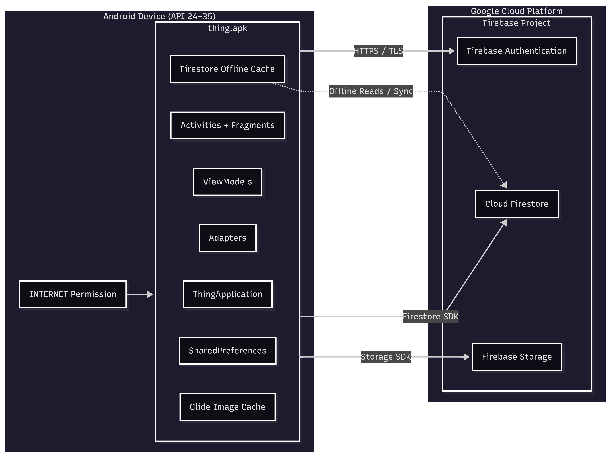

*Figure 16 — Deployment diagram showing the Android device node and Google Cloud Platform / Firebase node with all communication channels.*

---

### 8.2 Network & Permissions

| Permission | Purpose |
|------------|---------|
| `INTERNET` | All Firebase communication |

All client-to-Firebase traffic is encrypted via **HTTPS / TLS**. Firestore's local persistence cache serves reads during network loss. Asynchronous flows rely on Kotlin Coroutines and Firebase `Task` callbacks.

---

## 9. Scenarios Use Case View

The use case view illustrates the architecture through a small set of end-to-end scenarios. These validate the architectural decisions made in the Logical, Process, Development, and Physical views.

### 9.1 Use Case Overview

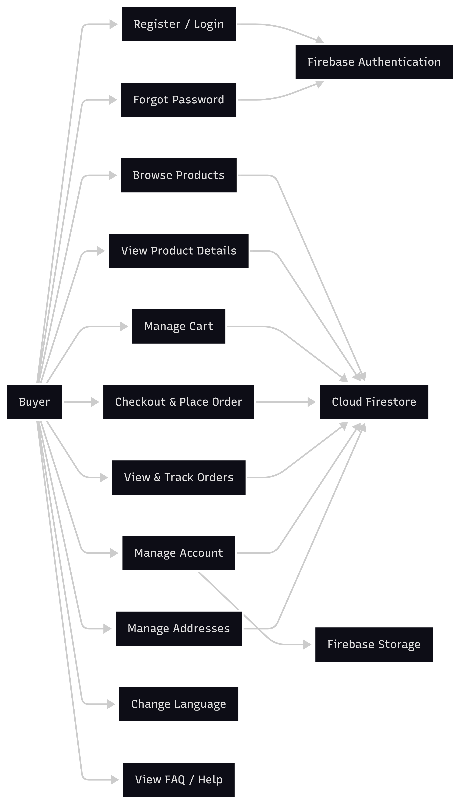

*Figure 17 — Use case overview diagram showing all supported use cases and their actors.*

---

### SC01 — New Buyer: Registration to First Purchase

| Field | Detail |
|-------|--------|
| **Scenario ID** | SC01 |
| **Title** | New Buyer: Registration to First Purchase |
| **Actors** | Buyer, FirebaseAuth, Firestore |
| **Preconditions** | App installed; user has no existing account |
| **Postconditions** | Order document written atomically to Firestore; cart cleared; buyer navigates back to HomeFragment |
| **Architectural Views Exercised** | Logical, Process, Physical |

**Use Case Diagram:**

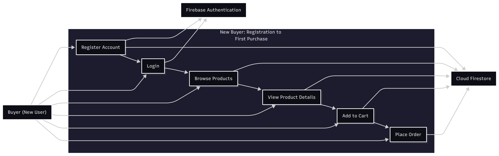

*Figure 18 — SC01 use case diagram: new buyer registration to first purchase.*

---

**Use Case Steps:**

| Step | ID | Actor | Action | System Response |
|------|----|-------|--------|-----------------|
| 1 | UC01 | Buyer | Opens app for the first time | `IntroductionFragment` checks `SharedPreferences` and `FirebaseAuth.currentUser` |
| 2 | — | System | Detects no session and no previous visit | Displays `IntroductionFragment` |
| 3 | UC01 | Buyer | Taps Start | Navigates to `AccountOptionsFragment` |
| 4 | UC01 | Buyer | Taps Register | `RegisterFragment` displayed |
| 5 | UC01 | Buyer | Enters name, email, password and taps Register | `RegisterViewModel` validates inputs and calls Firebase Auth |
| 6 | — | System | Auth confirmed | User document is written to Firestore |
| 7 | UC03 | Buyer | Browses product catalogue | Product grids are rendered |
| 8 | UC04 | Buyer | Taps a product tile | `ProductDetailsFragment` shown |
| 9 | UC05 | Buyer | Selects size and colour, taps Add to Cart | Product is added or quantity is increased |
| 10 | UC06 | Buyer | Proceeds to checkout | Cart and billing flow starts |
| 11 | UC06 | Buyer | Confirms order | `OrderViewModel.placeOrder` writes order and clears cart |

**Sequence Diagram:**

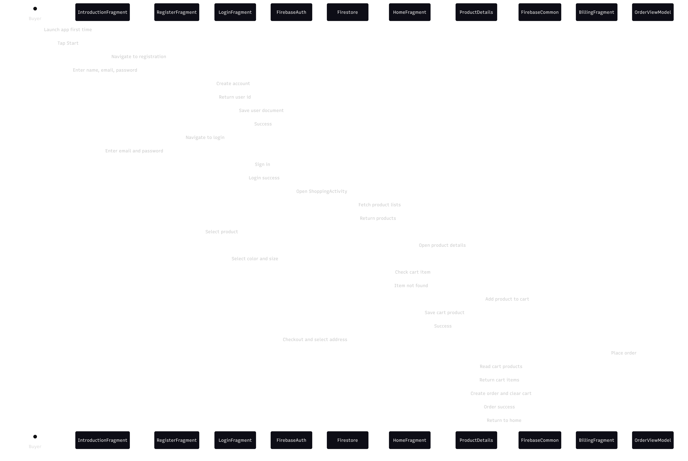

*Figure 19 — SC01 sequence diagram: full flow from registration to order confirmation.*

---

### SC02 — Returning Buyer: Track an Existing Order

| Field | Detail |
|-------|--------|
| **Scenario ID** | SC02 |
| **Title** | Returning Buyer: Track an Existing Order |
| **Actors** | Buyer, Firestore |
| **Preconditions** | Buyer is authenticated; at least one active order exists in Firestore |
| **Postconditions** | Buyer sees live order status with a step-progress indicator |
| **Architectural Views Exercised** | Logical, Process, Physical |

**Use Case Diagram:**

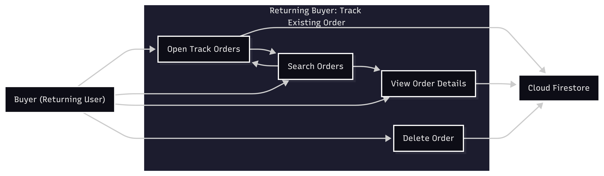

*Figure 20 — SC02 use case diagram: returning buyer tracking an existing order.*

---

**Use Case Steps:**

| Step | ID | Actor | Action | System Response |
|------|----|-------|--------|-----------------|
| 1 | UC07 | Buyer | Opens Profile → Track Orders | `AllOrdersFragment` fetches user orders |
| 2 | — | System | Data received | Order list rendered with status badges |
| 3 | UC07 | Buyer | Types order ID or date | Client-side search filters the order list |
| 4 | UC07 | Buyer | Taps an order row | `OrderDetailFragment` shows detailed order status |
| 5 | — | System | Buyer loses network | Firestore local cache serves last-known data |
| 6 | — | System | Network restored | Latest order state can be fetched again |

**Sequence Diagram:**

*Figure 21 — SC02 sequence diagram: order tracking with client-side search and offline fallback.*

---

## 10. Size & Performance

### 10.1 APK Metrics

| Metric | Value |
|--------|-------|
| Raw APK size | ~12.6 MB |
| Min SDK coverage | API 24+ |
| Permissions required | 1 |
| Supported locales | English, Turkish |

### 10.2 Performance Strategies

| Concern | Strategy |
|---------|----------|
| **Cold start** | `IntroductionFragment` checks auth state and SharedPreferences before first screen render |
| **List rendering** | `RecyclerView` with `AsyncListDiffer` and `DiffUtil` |
| **Image loading** | Glide handles disk and memory caching |
| **Database reads** | Firestore listeners are scoped to ViewModel lifecycles |
| **Offline reads** | Firestore local persistence cache serves data during network interruption |
| **Cart total calculation** | `totalPrice` is derived from cart state and recomputed only when the cart changes |

---

## 11. Quality

| Quality Attribute | Strategy | Evidence |
|-------------------|----------|----------|
| **Security** | Firebase Auth JWT tokens and Firestore Security Rules | Direct `FirebaseAuth` integration |
| **Reliability** | Strict Kotlin typing, sealed-class state modelling, Firebase infrastructure | `Resource<T>`, `OrderStatus`, `Category` |
| **Maintainability** | Two-Activity structure, Fragment modularity, Hilt dependency injection | `LoginRegisterActivity`, `ShoppingActivity`, `@HiltViewModel` |
| **Testability** | ViewModel separation from Fragments | Hilt-injected dependencies |
| **Accessibility** | Material Design components | `com.google.android.material` |
| **Portability** | Min SDK 24 | Android API 24+ |
| **Observability** | Debugging through Logcat and structured error states | `Resource.Error` |
| **Localisation** | English and Turkish string resources | `values`, `values-tr`, `LanguageFragment` |
| **Extensibility** | Layered MVVM architecture | UI, ViewModel, Data, Firebase separation |

---

## Appendix A — Acronyms & Abbreviations

| Term | Definition |
|------|------------|
| **APK** | Android Package Kit |
| **API** | Application Programming Interface |
| **ART** | Android Runtime |
| **DEX** | Dalvik Executable |
| **DI** | Dependency Injection |
| **JWT** | JSON Web Token |
| **MDC** | Material Design Components |
| **MVVM** | Model-View-ViewModel |
| **NoSQL** | Non-relational database |
| **SDK** | Software Development Kit |
| **TLS** | Transport Layer Security |
| **UID** | User Identifier |
| **UC** | Use Case |
| **SC** | Scenario |

---

## Appendix B — Definitions

| Term | Definition |
|------|------------|
| **Activity** | An Android component acting as a navigation host |
| **Fragment** | A modular UI screen hosted inside an Activity |
| **Firestore** | Firebase's managed document-oriented cloud database |
| **Firebase Storage** | Firebase's cloud file storage service |
| **Navigation Component** | AndroidX library managing Fragment navigation and back stack |
| **Hilt** | Dagger-based dependency injection library for Android |
| **Buyer** | An end consumer who browses and purchases furniture |
| **Cart** | A collection of `CartProduct` objects persisted in Firestore |
| **Order** | A confirmed purchase record persisted to Firestore |
| **ViewBinding** | AndroidX feature generating type-safe binding classes |
| **StateFlow / SharedFlow** | Kotlin observable streams used for reactive UI updates |
| **4+1 View Model** | Philippe Kruchten's architectural framework |

---

## Appendix C — Design Principles

| Principle | Application in thing. |
|-----------|----------------------|
| **Separation of Concerns** | Activities own navigation hosting, Fragments own UI rendering, ViewModels own state and business logic |
| **Multi-Activity Pattern** | `LoginRegisterActivity` and `ShoppingActivity` separate authentication and shopping concerns |
| **Serverless First** | Firebase eliminates custom backend infrastructure |
| **Offline-First Reads** | Firestore local cache improves perceived responsiveness |
| **Fail-Safe Error Handling** | Async paths propagate errors through `Resource.Error` |
| **Progressive Disclosure** | Onboarding screens introduce the marketplace before registration |
| **Layered Architecture** | UI → ViewModel → Data/Firebase → Firebase Services |
| **MVVM** | ViewModels hold and transform state; Fragments observe state |
| **Single Responsibility Principle** | Each class has one clear reason to change |
| **Don't Repeat Yourself** | Shared UI components are implemented once and reused |
| **Clean Code** | Descriptive naming, focused functions, and sealed classes improve readability |
| **Compile-Time Dependency Injection** | Dagger Hilt wires dependencies at compile time |

---

*Document maintained by Team thing. — SWE332, Altinbas University, Spring 2026.*
