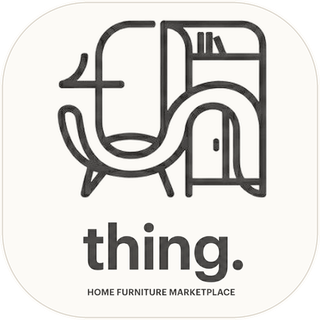

<table>
<tr>
<td width="320">

  

</td>
<td>

# thing.

</td>
</tr>
</table>

---

## Project Introduction

Furniture shopping today is fragmented — users jump between websites and physical stores with no unified way to discover and compare products.

**thing.** is a dedicated mobile marketplace where you can browse, filter, and purchase home furniture all in one place.

> *"Furniture may be just a thing — but it's **the thing.** that turns a house into a home."*

📐 Architecture documentation → 

---

## Team

| | Name | Student ID | GitHub |
|:---:|:---|:---:|:---|
|  | **Samed Tevin** | 230513327 |  |
|  | **Hasan Açıkel** | 220513343 |  |
|  | **Doğukan Süme** | 210513243 |  |
|  | **Kağan Şahin** | 220513375 |  |

---
## Documents

| Document | Link |
|:---------|:-----|
| 📐 Architecture | [ARCHITECTURE.md](./ARCHITECTURE.md) |

---

